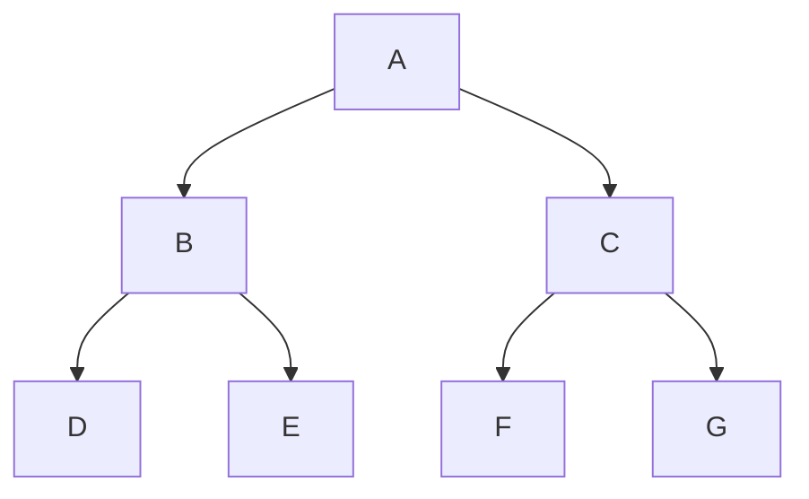

# Regression models

[Home](https://github.com/JorgeToT/Machine-Learning-Python-R)

- [Simple Lineal Regression Model](/Part%202%20-%20Regression/Section%204%20-%20Simple%20Linear%20Regression/Python/)
  - [Example](/Part%202%20-%20Regression/Section%204%20-%20Simple%20Linear%20Regression/Python/simple_linear_regression.ipynb)

$$y = \alpha x + \beta$$

- [Multiple Linear Regression Model](/Part%202%20-%20Regression/Section%205%20-%20Multiple%20Linear%20Regression/Python/)
  - [Example](/Part%202%20-%20Regression/Section%205%20-%20Multiple%20Linear%20Regression/Python/multiple_linear_regression.ipynb)

$$y = \alpha_1 x_1 + \alpha_2 x_2 + \alpha_3 x_3 + ... \alpha_n x_n + \beta$$

- [Polynomial Regression Model](/Part%202%20-%20Regression/Section%206%20-%20Polynomial%20Regression/Python/)
  - [Example](/Part%202%20-%20Regression/Section%206%20-%20Polynomial%20Regression/Python/polynomial_regression.ipynb)

$$y = \alpha_1 x + \alpha_2 x^2 + \alpha_3 x^3 + ... + \alpha_n x^n + \beta$$

- [Support Verctor Regression](/Part%202%20-%20Regression/Section%207%20-%20Support%20Vector%20Regression%20(SVR)/Python/)
  - [Example](/Part%202%20-%20Regression/Section%207%20-%20Support%20Vector%20Regression%20(SVR)/Python/support_vector_regression.ipynb)

Like the Linear Regression Model, the SVR model is a linear model that is used to predict the value of a dependent variable as a function of the values of the independent variables. Have $\epsilon$ be the error margin.

- [Decision Tree Regression Model](/Part%202%20-%20Regression/Section%208%20-%20Decision%20Tree%20Regression/Python/)
  - [Example](/Part%202%20-%20Regression/Section%208%20-%20Decision%20Tree%20Regression/Python/decision_tree_regression.ipynb)

- [Random Forest Regression Model](/Part%202%20-%20Regression/Section%209%20-%20Random%20Forest%20Regression/Python/)
  - [Example](/Part%202%20-%20Regression/Section%209%20-%20Random%20Forest%20Regression/Python/random_forest_regression.ipynb)

A random forest is a set of decision trees that are used to predict the value of a dependent variable as a function of the values of the independent variables.