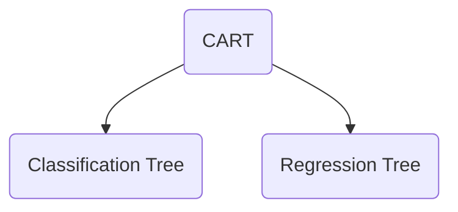

# Decission Tree Classification

[Home](/.)

[Example](decision_tree_classification.ipynb)

## Decision Tree Intuition


To do a decision tree classification, we have to use the code below.

First step, split the data into training and testing data.

 ```python
from sklearn.model_selection import train_test_split
X_train, X_test, y_train, y_test = train_test_split(X, y, test_size = 0.25, random_state = 0)
 ```

After split the data we need to scale the data.

```python
from sklearn.preprocessing import StandardScaler
sc = StandardScaler()
X_train = sc.fit_transform(X_train)
X_test = sc.transform(X_test)
```

And then we can create the model.

```python
from sklearn.tree import DecisionTreeClassifier
classifier = DecisionTreeClassifier(criterion = 'entropy', random_state = 0)
classifier.fit(X_train, y_train)
```

Now we can predict the data.

```python
print(classifier.predict(sc.transform([[30,87000]])))
```
