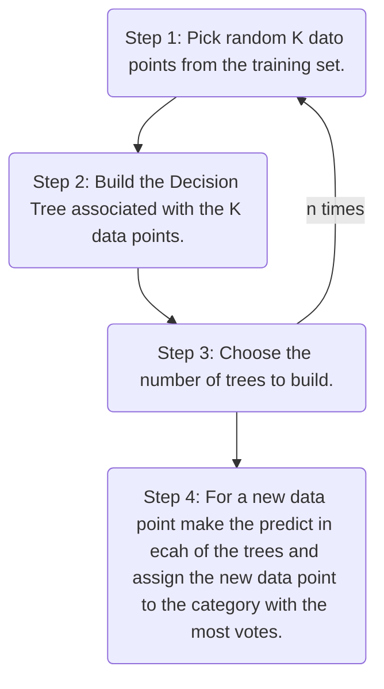

# Random Forest Classification

[Home](/.)

[Example](random_forest_classification.ipynb)

## Ensamble Learning

When you take multiple ML algorithms and combine them to create a new algorithm, you can use Ensemble Learning.

* Step 1: Pick random K dato points from the training set.
* Step 2: Build the Decision Tree associated with the K data points.
* Choose the number of trees to build.



To create a random forest, you must to use the code below.

First we need to split the data into training and testing data, and then scale the data.

```python
from sklearn.model_selection import train_test_split
X_train, X_test, y_train, y_test = train_test_split(X, y, test_size = 0.25, random_state = 0)

from sklearn.preprocessing import StandardScaler
sc = StandardScaler()
X_train = sc.fit_transform(X_train)
X_test = sc.transform(X_test)
```

Now we can create the random forest classifier.

```python
from sklearn.ensemble import RandomForestClassifier
classifier = RandomForestClassifier(n_estimators = 10, criterion = 'entropy', random_state = 0)
classifier.fit(X_train, y_train)
```

To finish we can predict the test set and calculate the accuracy.

```python
y_pred = classifier.predict(X_test)
print(np.concatenate((y_pred.reshape(len(y_pred),1)[:10], y_test.reshape(len(y_test),1)[:10]),1))

from sklearn.metrics import confusion_matrix, accuracy_score
cm = confusion_matrix(y_test, y_pred)
print(cm)
accuracy_score(y_test, y_pred)
```