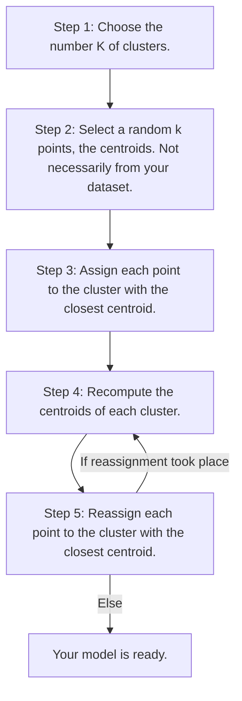

# K-Means Clustering

[Home](/.)

[Example](k_means_clustering.ipynb)

## K-Means Intution.
K-means is a clustering algorithm that is used to group data points into clusters. The algorithm is based on the idea that data points are similar if they are close to each other.



When we initialize the centroids, we choose k random points from the dataset. If the centroids are not the best, the solution is **K-means++**.

## Choosing the number of clusters.
To evaluate if the number of clusters is the best, we use the **Within-Cluster-Sum-of-Squares (WCSS)**.

$$\mathit{WCSS} = \sum_{i=1}^{n} \sum_{j=1}^{k} (distance(P_j,C_i))^2$$
Where: $P_j$ is each point in the Cluster $i$.

## The Elbow method.
This method is used to choose the optimal number of clusters.

```python
from sklearn.cluster import KMeans
wcss = []
for i in range(1, 11):
    kmeans = KMeans(n_clusters = i, init = 'k-means++', random_state = 42)
    kmeans.fit(X)
    wcss.append(kmeans.inertia_)
plt.plot(range(1, 11), wcss)
plt.title('The Elbow Method')
plt.xlabel('Number of clusters')
plt.ylabel('WCSS')
plt.show()
```

After we decide the number of clusters, we can train the model.

```python
kmeans = KMeans(n_clusters = 5, init = 'k-means++', random_state = 42)
y_kmeans = kmeans.fit_predict(X)
```

