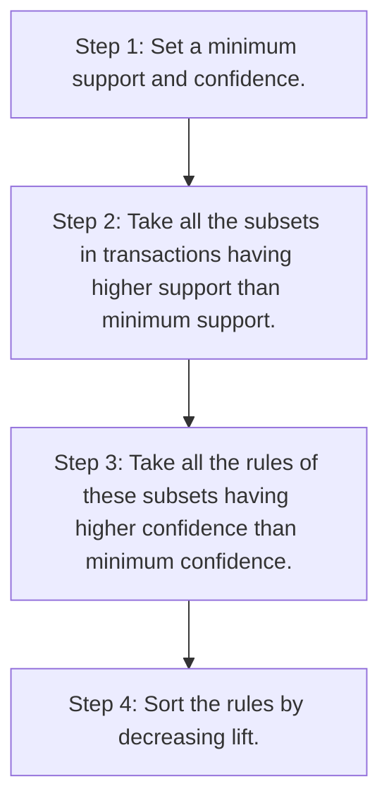

# Apriori Algorithm

[Home]()

[Excercise](apriori.ipynb)

## Apriori Intuition
People who bought a product also bought...

For example: Movie recommendation
* Step 1: Percentage 
$$support(M) = \frac{\text{Users watchlists containing } M}{\text{User watchlists}}$$
* Step 2: Confidence
$$confidence(M \rArr N) = \frac{\text{Users watchlists containing } M \text{ and } N}{\text{Users watchlists containing } M}$$
* Step 3: Lift
$$lift(M \rArr N) = \frac{confidence(M \rArr N)}{support(N)}$$

The process of a Priori algorithm is the next:


To train a Priori Association Rule Learning model, we need to:

```python
from apyori import apriori
rules = apriori(transactions = transactions, min_support = 0.003, min_confidence = 0.2, min_lift = 3, min_length = 2, max_length = 2)
results = list(rules)
```

After train the model, we can visualize the results ordered by decreasing lift.

```python
def inspect(results):
    lhs         = [tuple(result[2][0][0])[0] for result in results]
    rhs         = [tuple(result[2][0][1])[0] for result in results]
    supports    = [result[1] for result in results]
    confidences = [result[2][0][2] for result in results]
    lifts       = [result[2][0][3] for result in results]
    return list(zip(lhs, rhs, supports, confidences, lifts))
    
resultsinDataFrame = pd.DataFrame(inspect(results), columns = ['Left Hand Side', 'Right Hand Side', 'Support', 'Confidence', 'Lift'])
resultsinDataFrame.nlargest(n = 10, columns = 'Lift')
```
