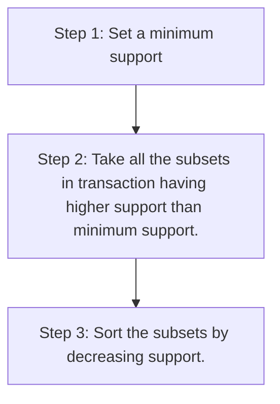

# Eclat model (ARL)

[Home]()

[Example](eclat.ipynb)

This model only based in one parameter: **Support**.

$support(M) = \frac{\text{Users watchlists containing } M}{\text{User watchlists}}$



To train the model we need to make the same steps as in the apriori method but only considering the subsets with higher support than the minimum support.

```python
from apyori import apriori
rules = apriori(transactions = transactions, min_support = 0.003, min_confidence = 0.2, min_lift = 3, min_length = 2, max_length = 2)
results = list(rules)
```

After train the model we can visualize the results and sort by support:

```python
def inspect(results):
    lhs         = [tuple(result[2][0][0])[0] for result in results]
    rhs         = [tuple(result[2][0][1])[0] for result in results]
    supports    = [result[1] for result in results]
    return list(zip(lhs, rhs, supports))
resultsinDataFrame = pd.DataFrame(inspect(results), columns = ['Product 1', 'Product 2', 'Support'])
resultsinDataFrame.nlargest(n = 10, columns = 'Support')
```